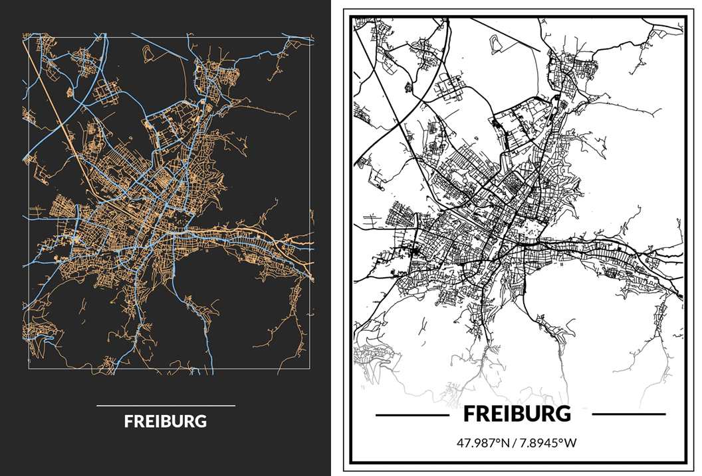
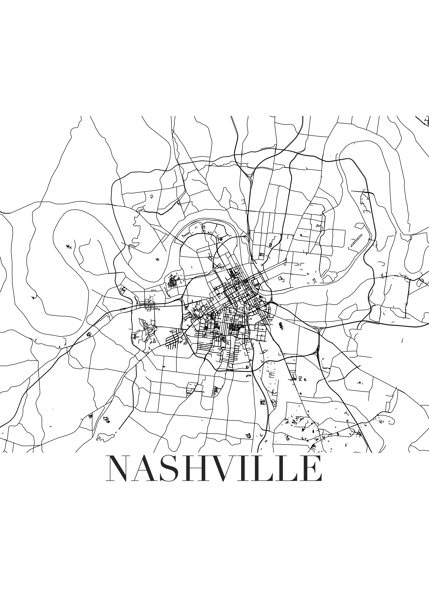

# README

Years ago I stumbled across Christian Burkhart's post where he shared how to create street/road maps in R with ggplot and osmdata (the openstreetmap R package). I thought it was so cool and wanted to dig into it myself.

\
This is Christian's take:\
{width="534"}

Here are mine:\
{width="384"}{width="384"}

# Other Resources

-   [ggplot2tor: Streetmaps](https://ggplot2tutor.com/streetmaps/streetmaps/) (inspiration)

-   [OpenStreetMap Features](https://wiki.openstreetmap.org/wiki/Map_Features#Highway)

-   [OpenStreetMap](https://www.openstreetmap.org/)

-   [OpenStreetMap Copyright](https://www.openstreetmap.org/copyright)

-   [Exploring historical maps and spatial data with R and OpenStreetMap](https://mhermans.net/post/mapping-leuvense-gangen/)

-   [R ggplot, remove white margins in ggsave/ggplot](https://stackoverflow.com/questions/35346111/r-ggplot-remove-white-margins-in-ggsave-ggplot)

-   [Remove Plot Margins in ggplot2](https://stackoverflow.com/questions/17786197/remove-plot-margins-in-ggplot2)

-   [Advanced Image-Processing in R with Magick, Part I](https://ropensci.org/blog/2016/08/23/z-magick-release/)

-   [Drawing beautiful maps programmatically with R, sf and ggplot2 — Part 1: Basics](https://www.r-spatial.org/r/2018/10/25/ggplot2-sf.html)

-   [Print Beautiful City Street Maps with R](https://taraskaduk.com/2019/12/20/print-maps/)

-   [The Beautiful Hidden Logic of Cities](https://erdavis.com/2019/07/27/the-beautiful-hidden-logic-of-cities/)

-   [Road Suffixes in the USA – Take 2](https://erdavis.com/2019/07/04/road-suffixes-in-the-usa-take-2/)

-   [Personal Art Map with R](http://estebanmoro.org/post/2020-10-19-personal-art-map-with-r/)

-   [Nashville map](https://society6.com/product/nashville-white-map_poster?sku=s6-8457988p66a213v756)

-   [Taras Kaduk: Print Personalized Street Maps Using R](https://taraskaduk.com/posts/2021-01-18-print-street-maps/)

-   [R for Journalists: how to access openstreetmaps](http://rforjournalists.com/2020/12/15/how-to-access-open-street-map-in-r/)

-   [city-roads tweet](https://twitter.com/paldhous/status/1219423127131717633?s=20)

-   [City-roads App](https://github.com/anvaka/city-roads)

-   [leeolney on Twitter](https://twitter.com/leeolney3/status/1456484664869326848?s=11) (and gist [here](https://gist.github.com/leeolney3/95cc3418cc719f1e89911d921b98873d))

-   [#Dataviz tutorial: Mapping San Francisco Home Prices in R](http://urbanspatialanalysis.com/dataviz-tutorial-mapping-san-francisco-home-prices-using-r/)
